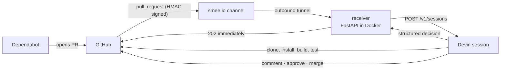
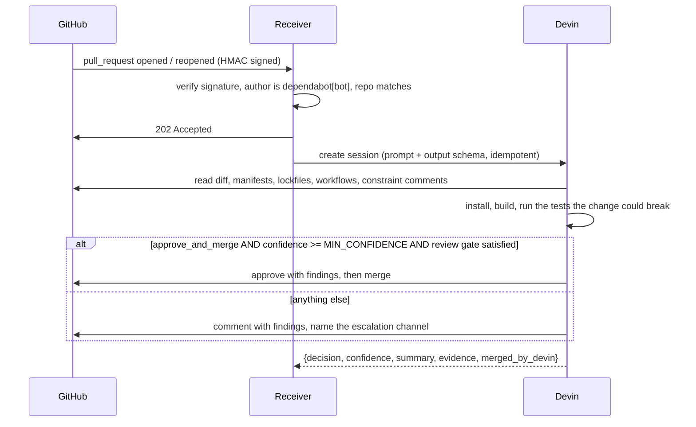

# devin-dependabot-triage

Devin as a reviewing teammate on dependency pull requests.

Dependabot opens a PR. A webhook starts a Devin session. Devin reads the repository —
manifests, lockfiles, CI workflows, **and the comments explaining why constraints
exist** — runs the install, build and tests the change could break, then either approves
and merges the PR or declines it with evidence and names a channel for a human.

The service holds no dependency knowledge: no safe-package list, no semver policy, no
CVE database. It authenticates an event and hands it to an engineer.

## What it did on a real run

Ten Dependabot PRs opened on a fork of `apache/superset` within six minutes; Devin
triaged all ten in parallel, no human in between.

| PR | Bump | A semver rule says | Devin |
| --- | --- | --- | --- |
| `@swc/*` group, 2 majors | major → refuse | traced usage to `webpack.config.js` only, ran a full production build, **merged** in 3m 21s |
| `@testing-library/user-event` patch | patch → merge | found the release changes pointer-event behaviour, ran 591 tests on those paths, **merged** in 3m 58s |
| `typescript` 5.4 → 7.0 | manifest permits it → merge | 21 lockfile entries cap peers `<6.1`, CI installs with plain `npm ci`, reproduced `ERESOLVE` — **declined** |
| `paramiko` 3.5 → 5.0 | `<4.0` pin → skip, forever | read the comment on the pin, verified `sshtunnel` still calls `DSSKey`, reproduced the `AttributeError` — **declined**, said what would unblock it |
| `react-dnd-html5-backend` 11 → 16 | major → refuse | v16 is ESM-only, 436 test files fail to load; **declined** with the correct two-package PR written out |

A rule reads the version number. The answer lives in a workflow file, a lockfile peer
range, or a code comment — places a rule never looks.

## How it works



The receiver returns `202` straight away — GitHub allows a webhook ten seconds and a
review takes minutes — and does the work in a background task.



### The merge gate

Devin merges only when all of these hold:

1. its decision is `approve_and_merge`;
2. its confidence is at least `MIN_CONFIDENCE` (default `0.8`);
3. if `REQUIRE_DEVIN_REVIEW=true`, the Devin Review verdict on the PR is `passed`.

Anything else — including a review that is absent, errored, cancelled or timed out —
means a comment saying which condition stopped it, and never a merge. Nothing here closes
a PR: a declined bump stays open with its evidence attached for a human to act on.

Set `ESCALATION_CHANNEL=#engineering` and every decline and escalation ends with a line
naming that channel for human follow-up. **Nothing is sent** — the line says so — it
marks where a Slack notification would go.

`MERGE_ACTOR=service` moves the approve/merge out of the session and into this service
(`apply_decision` in `app/github.py`), enforced on Devin's structured verdict. Same gate;
easier to unit test. Devin doing it is the better watch.

#### Devin Review as a second gate

With `REQUIRE_DEVIN_REVIEW=true` the service requests a Devin Review on the PR
(`TRIGGER_DEVIN_REVIEW=true`, `DEVIN_ORG_ID` set — or empty for the enterprise route),
waits for it, and only lets the merge through on `passed`. Requesting a review
programmatically needs an API key with that permission; on keys without it the request
returns `403` and, correctly, nothing merges. Set `REQUIRE_DEVIN_REVIEW=false` to run on
Devin's own decision plus the confidence floor.

## Run it

Prerequisites: Docker with Compose, Python 3.9+ for the helper scripts, a GitHub
repository you administer, and a Devin account with API access.

### 1. Configure

```bash
cp .env.example .env
```

The receiver refuses to start if a required value is missing.

| Variable | Required | Where to get it |
| --- | --- | --- |
| `TARGET_REPO` | yes | `owner/name` of the repository whose Dependabot PRs are triaged |
| `GITHUB_TOKEN` | yes | <https://github.com/settings/tokens> — classic PAT with `repo` (add `admin:repo_hook` if `setup_repo.py` should create the webhook), or a fine-grained token with Pull requests + Contents read/write on the repo |
| `GITHUB_WEBHOOK_SECRET` | yes | any random string, e.g. `openssl rand -hex 20`; paste the same value into the webhook's **Secret** field on GitHub |
| `DEVIN_API_KEY` | yes | <https://app.devin.ai/settings/api-keys> — a service key is fine |
| `SMEE_URL` | local runs | <https://smee.io/new> — see below |
| `DRY_RUN` | no (`false`) | `true` logs what would be posted and touches nothing on GitHub |
| `REQUIRE_DEVIN_REVIEW` | no (`true`) | also require a passed Devin Review before merging; `.env.example` sets `false` |
| `ESCALATION_CHANNEL` | no (empty) | channel named on declines, e.g. `#engineering`; nothing is sent |
| `MIN_CONFIDENCE` | no (`0.8`) | merge floor on Devin's stated confidence |
| `MERGE_ACTOR` | no (`devin`) | `service` makes this service do the approve/merge instead |
| `TRIGGER_DEVIN_REVIEW`, `DEVIN_ORG_ID` | only with review gate | request a Devin Review via `/v3/organizations/{org}/pr-reviews`; org id is the `org-…` in your app.devin.ai settings URL |
| `BOT_SENDERS` | no (`["dependabot[bot]"]`) | JSON list of PR authors to act on |

The settings used for the recorded run:

```dotenv
DRY_RUN=false
REQUIRE_DEVIN_REVIEW=false
ESCALATION_CHANNEL=#engineering
```

### 2. Start the receiver

```bash
docker compose up --build
```

`curl localhost:8000/healthz` should return `{"status":"ok"}`.

**Running locally?** GitHub has to reach the receiver, and your laptop has no public
URL. `docker-compose.yml` includes a [smee.io](https://smee.io) client for this: create a
channel at <https://smee.io/new>, put it in `SMEE_URL`, use the same URL as the webhook
payload URL on GitHub, and the `smee` container relays every delivery to
`http://receiver:8000/github/webhook` over an outbound connection — no port forwarding,
no deployment. Wait for `Connected https://smee.io/...` in the log before triggering
anything. smee.io is a public relay with no authentication, so it is for development
only; the HMAC check still rejects anything GitHub did not sign. Any tunnel works the
same way (`ngrok http 8000`, `cloudflared tunnel --url http://localhost:8000`): drop the
`smee` service and use the tunnel URL as the webhook payload URL instead.

**Deploying?** `fly deploy` uses the same Dockerfile. Remove the `smee` service and
point the webhook at `https://<app>.fly.dev/github/webhook`.

### 3. Point a repository at it

```bash
export GITHUB_TOKEN=... GITHUB_WEBHOOK_SECRET=...   # same values as .env
python3 scripts/setup_repo.py --repo OWNER/REPO --webhook-url https://smee.io/YOUR_CHANNEL
```

Standard library only. Enables Dependabot alerts, disables Actions (Superset runs 55
workflows per PR otherwise), and creates the webhook — content type `application/json`,
**Pull requests** events only. If the token cannot create hooks, add it by hand at
Settings → Webhooks with the same settings.

Then commit a scoped `.github/dependabot.yml` (see [`demo/dependabot.yml`](demo/dependabot.yml)
— Superset's own opens thirty PRs) and enable **Dependabot version updates** under
Settings → Advanced Security. That switch has no API and enabling it fires the first
check, so start the receiver first. [`demo/RUNBOOK.md`](demo/RUNBOOK.md) has the full
cold-start order.

### 4. Watch the log

```
POST /github/webhook 202 Accepted
PR #3 -> session https://app.devin.ai/sessions/...
PR #3: approve_and_merge (confidence 0.85), merged_by_devin=True, 3m 58s since it opened, 3m 45s since the webhook arrived
```

Devin's comment carries the same two durations. The second excludes however long the PR
sat before anything picked it up, so it is the one that is comparable across runs.

## Simulate it without waiting for Dependabot

**Re-run a real PR:** close and reopen it. `reopened` is triaged exactly like `opened`;
the author check uses the PR's author, not whoever clicked reopen.

**Fire a signed webhook at a local receiver, no GitHub involved** (standard library):

```bash
GITHUB_WEBHOOK_SECRET=<same as .env> python3 scripts/send_test_webhook.py \
  --repo OWNER/REPO --number 3
```

Pair it with `DRY_RUN=true` to see exactly what would be posted while touching nothing.
`--author someone-else` should return `204` (ignored); an unsigned request returns `401`.

**Stage your own dependency PRs** on Dependabot-style branches when the scheduler is not
cooperating: `./scripts/stage_fallback_prs.sh /path/to/checkout`, then set
`BOT_SENDERS='["dependabot[bot]","your-login"]'` in `.env` so the receiver accepts PRs
you authored.

## Development

```bash
python -m venv .venv && .venv/bin/pip install -r requirements-dev.txt
.venv/bin/python -m pytest -q                 # no network; GitHub stubbed with respx
.venv/bin/ruff check . && .venv/bin/ruff format --check . && .venv/bin/mypy app tests scripts
```

## Layout

```
app/config.py          settings, all environment-backed
app/models.py          Decision, ReviewResult, and the JSON schema sent to Devin
app/review_prompt.py   the prompt — the only file where the argument lives
app/devin.py           create a session, request a Devin Review, poll both
app/github.py          signature check, review verdict, approve/comment/merge
app/main.py            the webhook endpoint and background triage
scripts/setup_repo.py  everything about repo config that GitHub exposes over REST
scripts/send_test_webhook.py   signed local webhook, no GitHub needed
demo/                  curated dependabot.yml and the cold-start runbook
```
