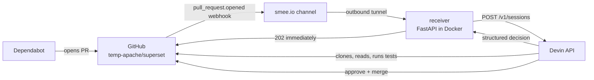

# devin-dependabot-triage

Devin as a reviewing teammate on dependency pull requests.

Dependabot opens a PR. A webhook starts a Devin session. Devin reads the advisory, the
repository's own version constraints **and the comments explaining them**, runs the
affected tests if the change could break something, and then either approves and merges
the PR or declines it with evidence.

## Why this is not Dependabot auto-merge

GitHub already ships auto-merge by update type, so approving a patch bump proves nothing.
The interesting cases are the ones a semver rule gets wrong, and this repository's demo
targets exactly those:

| PR | A rule says | Why it is wrong | Devin |
| --- | --- | --- | --- |
| `js-yaml 4.3.1 → 4.3.2` | merge, it's a patch | nothing — but only because the `overrides` block in `package.json` happens to admit `4.3.2`. A rule never checked. | verifies the override, approves, merges |
| `pytest 7.4.4 → 9.0.3` | merge — `pytest<10.0.0` allows it | two majors, and the comment on that cap says it was left deliberately un-validated | installs `9.0.3`, runs the suite, reports what actually breaks |
| `pytest 7.4.4 → 9.0.3`, rule set to skip majors | skip | silently drops a real advisory, forever | same as above |
| `xlsx`, `image-size` | nothing to do | no fixed release exists; the alert stays open with no explanation | explains that no bump can resolve it |

The second row is the whole pitch. A rule has two possible answers and both are wrong.
The reason is written in a code comment, which is the one place automation never looks.

## How it works



The receiver returns `202` straight away: GitHub allows a webhook ten seconds and a
review takes minutes, so the work happens in a background task.

```mermaid
sequenceDiagram
  participant GH as GitHub
  participant RX as Receiver
  participant DV as Devin

  GH->>RX: pull_request.opened (HMAC signed)
  RX->>RX: verify signature, sender is dependabot[bot]
  RX->>GH: 202 Accepted
  RX->>GH: read Devin Review verdict on the PR
  RX->>DV: create session (prompt + output schema)
  DV->>GH: read diff, manifests, comments; run tests
  alt approve_and_merge AND confidence >= 0.8 AND Devin Review passed
    DV->>GH: approve with summary, then squash merge
  else anything else
    DV->>GH: comment with the decision and why it was not merged
  end
  DV-->>RX: structured output {decision, confidence, summary, evidence}
```

Steps up to the session are identical for both PRs. Everything that differs happens
inside Devin.

### The merge gate

Devin merges only when all three hold:

1. its decision is `approve_and_merge`;
2. its confidence is at least `MIN_CONFIDENCE` (default `0.8`);
3. the Devin Review verdict on the PR is `passed`.

Otherwise it comments and says which condition stopped it. Set `MERGE_ACTOR=service` to
move the approve/merge into this service instead — same gate, enforced in code
(<code>app/github.py</code>, `apply_decision`), which is easier to unit test and easier
to show on a slide. Devin doing it is the better watch.

> Devin Review only runs in repositories connected to your Devin organisation. If the
> target repository is not connected, the verdict reads `absent` and nothing will ever
> merge. Either connect it or set `REQUIRE_DEVIN_REVIEW=false`.

## Setup

### 1. Configure the target repository

```bash
export GITHUB_TOKEN=ghp_...           # repo + security_events + admin:repo_hook
export GITHUB_WEBHOOK_SECRET=$(openssl rand -hex 20)
python scripts/setup_repo.py --repo temp-apache/superset --webhook-url https://smee.io/YOUR_CHANNEL
```

That enables Dependabot alerts and security updates, disables Actions (Superset carries
55 workflows and every PR would drag the full matrix along), and creates the webhook.

**One switch has no REST endpoint and you must click it:** Dependabot *version updates*
on a fork. Forks do not inherit it from a committed `.github/dependabot.yml`.

> Settings → Advanced Security → Dependabot version updates → Enable

### 2. The Python PR will not open until you add a pip entry

Superset's `.github/dependabot.yml` points `pip` at `/`, which only sees
`pyproject.toml`. The `pytest` pin lives in `requirements/development.txt`. Add to the
fork:

```yaml
  - package-ecosystem: "pip"
    directory: "/requirements"
    schedule:
      interval: "daily"
```

### 3. Run the receiver

```bash
cp .env.example .env      # fill in GITHUB_TOKEN, GITHUB_WEBHOOK_SECRET, DEVIN_API_KEY, SMEE_URL
docker compose up --build
```

Get `SMEE_URL` from <https://smee.io/new>. The `smee` service holds an outbound
connection so GitHub can reach the receiver with no inbound port and no deployment.

Check it: `curl localhost:8000/healthz`.

To deploy for real instead, `fly deploy` uses the same Dockerfile — drop the `smee`
service and point the webhook at the Fly URL. Nothing else changes.

### 4. Dry run first

Set `DRY_RUN=true` and open a PR. The receiver logs exactly what it would post and
touches nothing. Also worth doing before the demo: install `pytest 9.0.3` in a Superset
checkout and run the suite, so you know what Devin is going to find.

## If Dependabot has not fired by demo time

Its scheduler is not yours to control. `scripts/stage_fallback_prs.sh` opens the same two
diffs on Dependabot-style branch names:

```bash
./scripts/stage_fallback_prs.sh ~/repos/superset
```

Closing and reopening one of those fires the identical webhook path.

## Development

```bash
python -m venv .venv && .venv/bin/pip install -r requirements-dev.txt
.venv/bin/python -m pytest        # 19 tests, no network
.venv/bin/ruff check . && .venv/bin/mypy app scripts
```

Send a signed webhook at a locally running receiver without GitHub (standard library
only, no install needed):

```bash
GITHUB_WEBHOOK_SECRET=<same as .env> python3 scripts/send_test_webhook.py
```

## Layout

```
app/config.py          settings, all environment-backed
app/models.py          Decision, ReviewResult, and the JSON schema sent to Devin
app/review_prompt.py   the prompt — the only file where the demo's argument lives
app/devin.py           create a session, poll for structured output
app/github.py          signature check, Devin Review verdict, approve/comment/merge
app/main.py            the webhook endpoint
scripts/setup_repo.py  everything about repo config that GitHub exposes over REST
```
