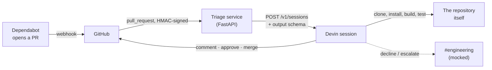
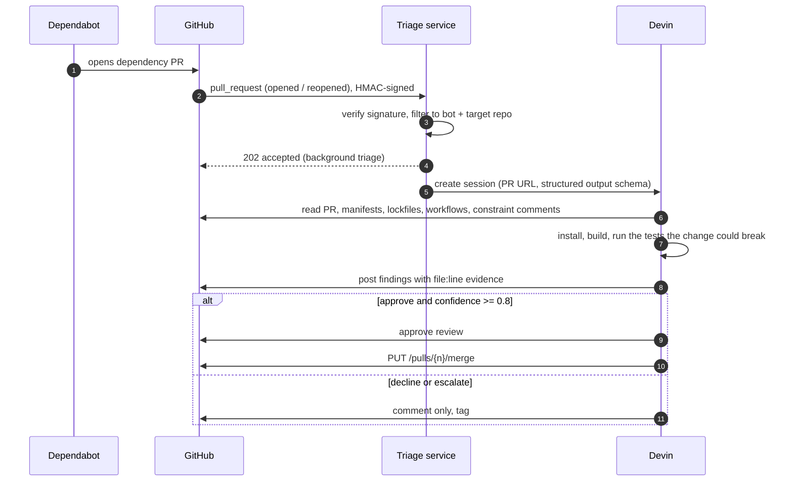
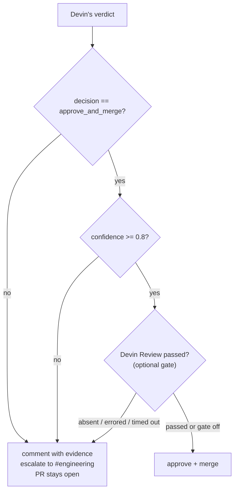
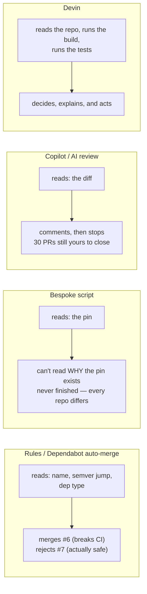
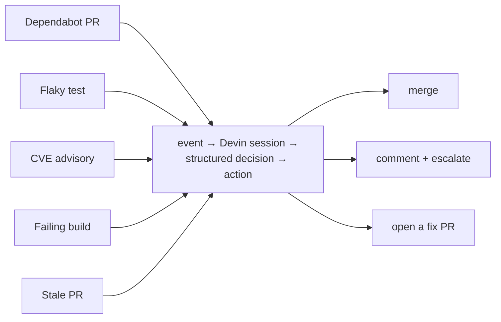

# Devin Dependabot triage — demo brief

Everything here is taken from the GitHub record on `temp-apache/superset` (a fresh fork
of `apache/superset`), 2026-09-13. Every timestamp and quote is checkable on the PR pages.

Recording covers four cases: **#7** and **#3** (opened, reviewed and merged by Devin,
unattended), **#4** (the world changed mid-review), and **#8** (decline with a diagnosis
and a recommended fix).

---

## 1. What the system is

A small service — a webhook receiver and a prompt, a few hundred lines — doing one thing:



**The service contains no dependency knowledge at all.** No list of safe packages, no
semver policy, no CVE database, no per-package rules. It authenticates an event and hands
it to an engineer. Every judgment below came from Devin reading *that* repository.

### What happens inside one triage



### The decision gate



Every gate fails closed: anything unknown means comment, never merge.

---

## 2. The run: ten PRs, one trigger, no human

Dependabot opened ten PRs in six minutes (14:11–14:17). Devin triaged all ten in parallel.

| PR | Bump | Decision | Outcome |
|----|------|----------|---------|
| #1 | `paramiko` 3.5.1 → 5.0.0 | decline | comment + escalation |
| #2 | `databricks-sqlalchemy` 1.0.5 → 2.0.10 | approve 0.9 | approved; merge lost a race |
| **#3** | `@testing-library/user-event` 14.6.5 → 14.6.7 | **approve** | **merged by Devin, 3m 58s** |
| **#4** | `@swc/core` 1.16.1 → 1.16.2 | **approve** | **superseded 11s before the verdict** |
| #5 | `react-window` 2.3.0 → 2.3.1 | approve | approved; merge lost a race |
| #6 | `typescript` 5.4.5 → 7.0.2 | decline 0.95 | comment + escalation |
| **#7** | `@swc/*` group — 1 patch + **2 majors** | **approve 0.9** | **merged by Devin, 3m 21s** |
| **#8** | `react-dnd-html5-backend` 11 → 16 | **decline** | comment + fix recommendation |
| #9 | `stylelint` 17.14.1 → 17.15.0 | approve 0.95 | approved; merge blocked by tooling |
| #10 | `@playwright/test` 1.62.1 → 1.63.0 | approve 0.85 | approved; merge blocked by tooling |

**Two merges landed with GitHub recording `merged_by: devin-ai-integration[bot]`.**

---

## 3. The four cases

### #7 — two major bumps, merged in 3m 21s *(the strongest case)*

`@swc/core` patch **plus** `@swc/plugin-emotion` 15 → 16 and
`@swc/plugin-transform-imports` 13 → 14.

**Every rules-based tool declines this on sight: two majors.** Devin merged it, having
established:

- the three packages are consumed only by `swc-loader` in `webpack.config.js`, never
  imported by product code, and Jest transforms via babel — so the blast radius is build
  tooling, not the shipped app;
- the plugin majors track the swc Wasm ABI, so the actual risk is *"plugins fail to load
  with this core"* — which is testable rather than guessable;
- it tested exactly that: loaded both plugins with the real webpack config, then ran a
  full `npm run build` → `webpack compiled with 4 warnings, exit=0`, and checked those
  four warnings were pre-existing asset-size notices.

> **Line to say:** major versions aren't dangerous — *unverified* changes are. A rule can
> only read the number. Devin worked out what would actually break, and proved it didn't.

### #3 — approved and merged 3m 58s after Dependabot opened it *(the speed case)*

Opened 14:11:51 · approved 14:15:36 · **merged 14:15:49 by Devin**.

`@testing-library/user-event` 14.6.5 → 14.6.7. What Devin did before approving:

- confirmed the diff touches only `package.json` and the lockfile;
- checked the `overrides` block for anything that would silently undo the bump on the next
  install (there is one — deck.gl, jest internals, `dompurify`, `nanoid`, `tar` — none of
  them this package);
- ran `npm ls` to prove a single deduped 14.6.7 across all six workspaces;
- read the release notes, saw they change **pointer-event and DataTransfer behaviour**,
  and therefore ran the suites that exercise those paths: **30 suites, 591 tests, green**;
- posted its own turnaround time in the comment.

> **Line to say:** it didn't approve because the version jump looked small. It identified
> what this release could break *in this repository*, and ran those tests. In four minutes.

### #4 — the world changed mid-review *(the autonomy case)*

Timeline, to the second:

| | |
|---|---|
| 14:12:20 | Dependabot opens #4, `@swc/core` 1.16.1 → 1.16.2 |
| 14:14:06 | Dependabot **closes #4 itself**: *"Superseded by #7"* — it had regrouped the `@swc/*` packages into one PR |
| 14:14:18 | Devin posts its verdict on #4: **approve and merge**, with full verification |
| 14:17:25 | Devin merges **#7**, the replacement, after separately verifying the two majors in it |

Devin's #4 verification was real work, not a rubber stamp: it ran the webpack SWC loader
config over **1,639 source files** with the new compiler — *"transformed 1639 files OK,
0 failed"* — plus a minifier smoke test. **117 seconds after the PR opened.**

Then the PR vanished underneath it, and nothing bad happened: it didn't merge a closed PR,
didn't error, didn't need a human. The replacement came through the same pipeline and got
merged on its own merits.

> **Line to say:** this is what "autonomous" actually means in practice. Not a happy path —
> a queue that reorganises itself while you're working, handled without anyone watching.
> Also note who created the churn: the deterministic bot opened a PR, then withdrew it two
> minutes later. Devin absorbed that.

### #8 — declined, with the fix written out *(the "review tool" case)*

`react-dnd-html5-backend` 11.1.3 → 16.0.1.

- Devin first ruled out the easy objection: no `overrides` pins this package, so the bump
  *would* stick — that isn't the blocker.
- It found the real one: **v16 is ESM-only** (`"type": "module"`) and isn't listed in
  Jest's `transformIgnorePatterns`. The shared test helper imports `HTML5Backend`, and
  **436 test files** use that helper — so they fail to even load:
  ```
  SyntaxError: Cannot use import statement outside a module
    at Object.require (spec/helpers/testing-library.tsx:39:1)
  ```
- It checked attribution: an unrelated suite that doesn't use the helper still passes, so
  the failure belongs to this PR.
- It noticed the PR leaves `react-dnd` itself on v11, so the lockfile would carry **two
  copies of `dnd-core`** on different majors.
- Then it wrote the actual fix: bump `react-dnd` and `react-dnd-html5-backend` to 16
  together (matching `react-dnd-test-backend@^16` already present) in a hand-made PR that
  also adds the ESM packages to the Jest allow-list.

> **Line to say:** a review tool would say "major version bump, review carefully". Devin
> says which 436 files break, why, that it isn't pre-existing, and what the correct PR
> looks like. The engineer who picks this up starts from a diagnosis, not a diff.

---

## 4. Speed

| | Time to first reasoned review |
|---|---|
| Human reviewer (baseline) | ~51 hours |
| Deterministic bot | ~7 hours |
| **Devin, this run** | **1m 20s – 3m 42s** |

```mermaid
gantt
  title Time to first reasoned review
  dateFormat X
  axisFormat %s
  section Devin
  "~4 min"        :done, 0, 240
  section Bot
  "~7 hours"      :active, 0, 25200
  section Human
  "~51 hours"     :crit, 0, 183600
```



Each comment carries its own measurement, e.g. from #3: *"Reached 3m 45s after the pull
request opened, 3m 42s after this service saw it."* The second number is the honest one —
it excludes however long the PR sat in Dependabot's queue and is comparable across runs.

Ten PRs were triaged **concurrently**, and turnaround didn't degrade with volume. That's
the throughput argument no human reviewer can make.

---

## 5. Why this beats each alternative



**vs. rules (Dependabot auto-merge, Renovate policies).** On this run a rule is wrong in
both directions: it merges `typescript` 7 (#6 — the manifest allows it, CI dies at
install) and refuses the `@swc` group (#7 — two majors, proven safe by a real build). The
inputs that decide both — peer ranges buried in a lockfile, the install command in a
workflow file, which files import the package — aren't available to a rule.

**vs. a bespoke script.** A script can read a `<4.0` pin. It cannot read the comment next
to it — *"4.0 removed DSSKey, still referenced by sshtunnel"* — decide whether that's
still true, check whether a newer `sshtunnel` exists, and reproduce the AttributeError in
a clean venv. Devin did all four on #1. Every repo has a different set of such
constraints, so the script is never finished.

**vs. Copilot / AI review tools.** They read a diff and comment. Devin **ran** things:
`npm ci`, `npm run build`, 591 Jest tests, 1,639-file compile checks, a clean-venv repro.
And it **acts** — approve and merge, on GitHub's record. Advice on thirty PRs is still
thirty PRs of your work.

**vs. a human reviewer.** Comparable reasoning — arguably more thorough, since few humans
run the full suite for a patch bump — in 3 minutes instead of 51 hours, ten at a time. And
the declines are *better* for the human: not an unread queue, but three PRs each carrying
a written diagnosis and a recommended fix.

> **The one-sentence version:** everything else classifies the change; Devin investigates
> the repository — and then acts on what it found.

---

## 6. Safety — the part that makes it deployable

- **Merge gates:** `approve_and_merge` + confidence ≥ 0.8 + (optionally) a passing Devin
  Review. Any gate failing means comment-only.
- **Fail closed:** a missing, errored, cancelled or timed-out review blocks the merge.
  Observed, not just designed — an earlier run had Devin conclude approve at 0.9 and
  refuse to merge because the review verdict was absent.
- **Escalation, not silence:** declines end with *"this would notify `#engineering` in
  Slack for human review"*; approvals don't. Only the judgment calls reach a person —
  thirty PRs become three conversations.
- **Declines stay open.** Closing them would tell Dependabot to stop offering that
  version, burying a real constraint. The value is the diagnosis on the PR.
- **`DRY_RUN`** decides everything without touching the PR — how you onboard a new repo.
- **`MERGE_ACTOR`** switches between Devin acting directly and the service acting on
  Devin's structured verdict, so who holds write access is a deployment choice.

---

## 7. What to claim, and what not to

**Claim:** two PRs merged autonomously, GitHub recording Devin as the merger, under four
minutes each. Three declined with reproduced evidence. Ten triaged in parallel from one
webhook, including one that Dependabot withdrew mid-review.

**Don't claim every approval merged.** Four didn't land: two lost a race against another
merge into `master` seconds earlier (GitHub rejects a merge when the base moves — both sit
approved and clean), and two hit a platform restriction on merging into a default branch.
Neither is a reasoning failure; both are fixed in the current code but weren't re-verified
live. If it comes up it's a good answer: the gate logic was never the problem, and the
failures were loud and visible on the PR rather than silent.

**Don't claim a working Slack integration.** The escalation line says *mocked — no Slack
connection in this demo*, deliberately. Devin has a native Slack integration; wiring it is
configuration, not a build.

**Devin Review** was off for this run (`REQUIRE_DEVIN_REVIEW=false`): triggering a review
programmatically returned 403 for both API keys tested, on both org- and enterprise-scoped
endpoints. The gate is implemented and fails closed — a permissions boundary, not a design
gap, and good material for the closing slide.

---

## 8. Suggested close — what this becomes in production

- **Devin Review as a second gate** — an independent review that must pass before merge.
- **Real Slack escalation** — declines land in `#engineering` with the diagnosis, so a
  human sees three items instead of thirty.
- **The same pattern well beyond Dependabot** — the service is just *event → Devin session
  → structured decision → action*:



> **The claim to land:** this isn't a dependency bot. It's an engineer that happens to be
> pointed at dependency PRs today.
